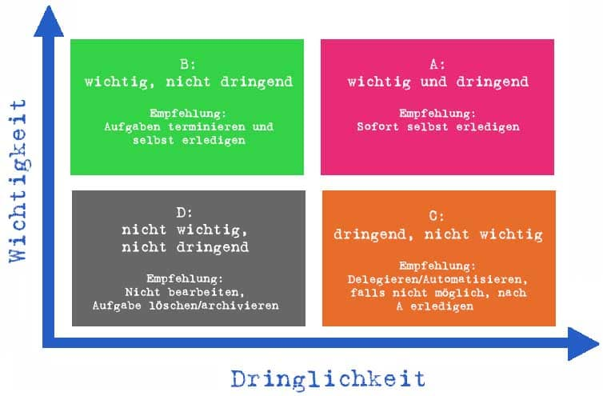
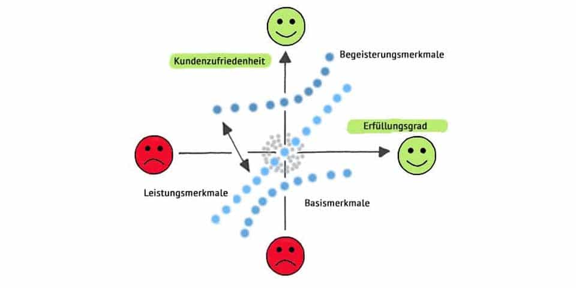

# Anforderungsanalyse

## Allgemeines 

Bei der Softwareentwicklung müssen die Anforderungen des Kunden umgesetzt werden. Im Vorfeld muss bereits versucht werden, **die Wünsche des Kunden** zu verstehen.

?> Unter einer Anforderung versteht man, eine **geforderte Leitstung bzw. Eigenschaft** eines Softwareprodukts.

Bei der Planung wird zur **Qualitätssicherung**  der Terminkreis (PDCA Zyklus) berücksichtigt.

## Schritte

Es werden Gespräche mit den zukünftigen Anwedern geführt. Eventuell werden bestehende Anwendungen aktuallisiert.     In  dieser Phase können auch Papierdokumente in einen **digitalen Prozess** überführt. 

 Mit einem **Lastenheft beschreibt der Auftraggeber** seine Anforderungen und Vorstellungen an die Software (aktives Zuhören, inhaltlich Analysieren, Spezialwissen und Validieren). Grundsätzlich muss sich der Workflow an die **logischen** Abläufe halten. 
 Die technische Umsetzung (Framework, Programmiersprache, Komponenete von z.B. SyncFusion, ...) ist für den Kunden nicht relevant.
 Beim Kundenkontakt soll die **Sprache des Kunden** gesprochen werden.

### Eisenhower-Matrix

Die Eisenhower Matrix ist eine Methode des Zeitmanagements zur Unterscheidung von wichtigen und unwichtigen, von dringenden und nicht dringenden Aufgaben. Alternativ wird sie auch als Vier-Quadranten-Methode, Eisenhower Methode, Eisenhower Prinzip oder Eisenhower Box bezeichnet.
Ziel der Eisenhower Matrix ist es, Aufgaben nach ihrer Wichtigkeit und Dringlichkeit zu sortieren und zu priorisieren.

Um Aufgaben zu sortieren und zu priorisieren gilt es pro Aufgabe zwei Fragen zu beantworten:

* Wie wichtig ist die Aufgabe?
* Wie dringend ist die Aufgabe?

Zu den Prinzipien zählen: 

* Wichtige Aufgaben sind solche, die unmittelbar einen Bezug zu definierten Zielen besitzen.
* Dringende Aufgaben dulden keinen Aufschub und sind idealerweise sofort zu erledigen.
* Wichtige und dringende Aufgaben sollten selbst und schnellstmöglich erledigt werden.
* etc.

### Kano-Modell

Das Kano-Modell beschreibt den Zusammenhang zwischen Kundenzufriedenheit und der Erfüllung von Kundenanforderungen. Es wird daher auch als Modell der Kundenzufriedenheit bezeichnet.

Merkmale die Auswirkung auf die Kundenzufriedenheit haben:

* Basismerkmale (sind für Kunden selbstverständlich und werden vorausgesetzt)
* Leistungsmerkmale (werden von Kunden explizit erwartet)
* Begeisterungsmerkmale (begeistern den Kunden)
* Unerhebliche Merkmale (führen weder zu Zufriedenheit noch zu Unzufriedenheit)
* Rückweisungsmerkmale (führen durch bloße Existenz zu Unzufriedenheit)

