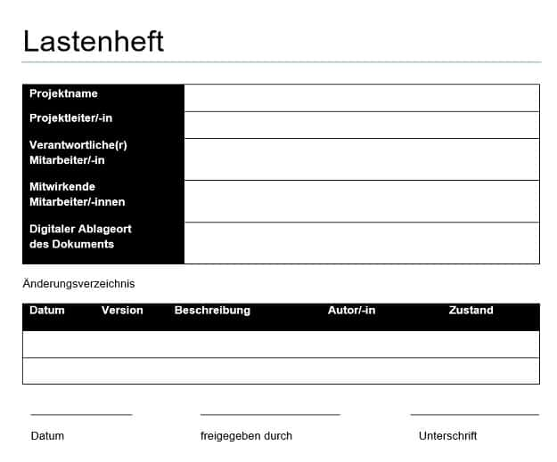

# Anforderungsanalyse

## Allgemeines 

Bei der Softwareentwicklung müssen die Anforderungen des Kunden umgesetzt werden. Im Vorfeld muss bereits versucht werden, **die Wünsche des Kunden** zu verstehen.

?> Unter einer Anforderung versteht man, eine **geforderte Leitstung bzw. Eigenschaft** eines Softwareprodukts.

Bei der Planung wird zur **Qualitätssicherung**  der Terminkreis (PDCA Zyklus) berücksichtigt.

## Schritte

Es werden Gespräche mit den zukünftigen Anwedern geführt. Eventuell werden bestehende Anwendungen aktuallisiert.     In  dieser Phase können auch Papierdokumente in einen **digitalen Prozess** überführt. 

 Mit einem **Lastenheft beschreibt der Auftraggeber** seine Anforderungen und Vorstellungen an die Software (aktives Zuhören, inhaltlich Analysieren, Spezialwissen und Validieren). Grundsätzlich muss sich der Workflow an die **logischen** Abläufe halten. 
 Die technische Umsetzung (Framework, Programmiersprache, Komponenete von z.B. SyncFusion, ...) ist für den Kunden nicht relevant.
 Beim Kundenkontakt soll die **Sprache des Kunden** gesprochen werden.

### Eisenhower-Matrix

Die Eisenhower Matrix ist eine Methode des Zeitmanagements zur Unterscheidung von wichtigen und unwichtigen, von dringenden und nicht dringenden Aufgaben. Alternativ wird sie auch als Vier-Quadranten-Methode, Eisenhower Methode, Eisenhower Prinzip oder Eisenhower Box bezeichnet.
Ziel der Eisenhower Matrix ist es, Aufgaben nach ihrer Wichtigkeit und Dringlichkeit zu sortieren und zu priorisieren.

Um Aufgaben zu sortieren und zu priorisieren gilt es pro Aufgabe zwei Fragen zu beantworten:

* Wie wichtig ist die Aufgabe?
* Wie dringend ist die Aufgabe?

Zu den Prinzipien zählen: 

* Wichtige Aufgaben sind solche, die unmittelbar einen Bezug zu definierten Zielen besitzen.
* Dringende Aufgaben dulden keinen Aufschub und sind idealerweise sofort zu erledigen.
* Wichtige und dringende Aufgaben sollten selbst und schnellstmöglich erledigt werden.
* etc.

### Kano-Modell

Das Kano-Modell beschreibt den Zusammenhang zwischen Kundenzufriedenheit und der Erfüllung von Kundenanforderungen. Es wird daher auch als Modell der Kundenzufriedenheit bezeichnet.

Merkmale die Auswirkung auf die Kundenzufriedenheit haben:

* Basismerkmale (sind für Kunden selbstverständlich und werden vorausgesetzt)
* Leistungsmerkmale (werden von Kunden explizit erwartet)
* Begeisterungsmerkmale (begeistern den Kunden)
* Unerhebliche Merkmale (führen weder zu Zufriedenheit noch zu Unzufriedenheit)
* Rückweisungsmerkmale (führen durch bloße Existenz zu Unzufriedenheit)

### MoSCow-Methode

Die MoSCoW-Methode ist ein vierstufiges Verfahren der Priorisierung. Meist wird sie zur Kategorisierung von Anforderungen genutzt, grundsätzlich eignet sie sich bspw. auch zur Priorisierung von Zielen, Aktivitäten oder Änderungsanträgen. Als Erfinder der MoSCoW-Methode gilt Dai Clegg, der die Methode 1994 bei Oracle erstmals im Rahmen der sogenannten Dynamic Systems Development Method (DSDM) nutzte. Heute wird MoSCoW – auch als MoSCoW-Prinzip, -Analyse oder -Priorisierung bezeichnet.

Die einzelnen, großgeschriebenen Buchstaben stehen für vier Kategorien:

* **M = Must** (have)
* **S = Should** (have)
* **C = Could** (have)
* **W = Won’t** (have)

### Priorisierung

Sie haben mehr Aufgaben, als Sie an einem Tag erledigen können. Sie haben mehr Anforderungen als Sie innerhalb einer Iteration realisieren können. Oder Sie haben verschiedene potentielle Projekte und benötigen eine Entscheidung, welches dieser Projekte Sie als erstes realisieren wollen. Es gibt viele Situationen, in den Menschen und Organisationen Reihenfolgen definieren müssen. Den Vorgang zur Bewertung von gleichartigen Elementen nach bewusst gewählten Kriterien mit dem Ziel, eine Rangordnung der Elemente zu erreichen, nennt sich Priorisierung.

### Lastenheft

Die DIN 69901-5 definiert ein Lastenheft als „vom Auftraggeber festgelegte Gesamtheit der Forderungen an die Lieferungen und Leistungen eines Auftragnehmers innerhalb eines Auftrages“. Es handelt sich also um ein Dokument des Auftraggebers mit den Ergebnissen der Anforderungsanalyse und damit um einen Wunschzettel, den ein Auftragnehmer realisieren soll. Idealerweise sollten die Formulierungen in einem Lastenheft so allgemein wie möglich und so einschränkend wie nötig formuliert werden, so dass Auftragnehmer Lösungen entwickeln können, ohne zu sehr in ihren Kompetenzen eingeschränkt zu werden.

### Pflichtenheft

Das Pflichtenheft enthält das detaillierte Arbeitskonzept für die gesamte Umsetzung eines Projektes. Es basiert auf den Ausführungen, die der Auftraggeber im Lastenheft niedergeschrieben hat.

Ähnlich wie das Lastenheft ist auch das Pflichtenheft eine große Hilfe bei umfangreichen Projekten, in denen es einen Auftragnehmer und einen Auftraggeber gibt. Erhält ein Auftragnehmer einen Auftrag, soll dieser möglichst genau die Anforderungen des Auftragsnehmers erfüllen. Gleichzeitig prüft der Auftragnehmer idealerweise im Vorfeld, in wie weit die Anforderungen des Auftraggebers umsetzbar sind. Dabei helfen sowohl das Lasten- als auch das Pflichtenheft. Aber was ist letzteres eigentlich? Und wie wird ein Pflichtenheft richtig erstellt?