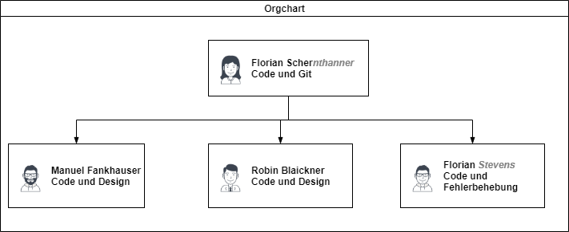

### Mathetrainer
Das Wasserfallmodell ist ein lineares Vorgehensmodell, das Entwicklungsprozesse in aufeinanderfolgende Projektphasen unterteilt. Im Gegensatz zu iterativen Modellen wird jede Phase nur einmal durchlaufen. ... Zur Anwendung kommt das Wasserfallmodell insbesondere in der Software-Entwicklung. Der Computerwissenschaftler Winston W. Roice schlägt ein Modell mit folgenden 7 Phasen vor:
- Systemanforderungen
- Software-Anforderungen
- Analyse
- Design
- Implementierung
- Test
- Betrieb
    
